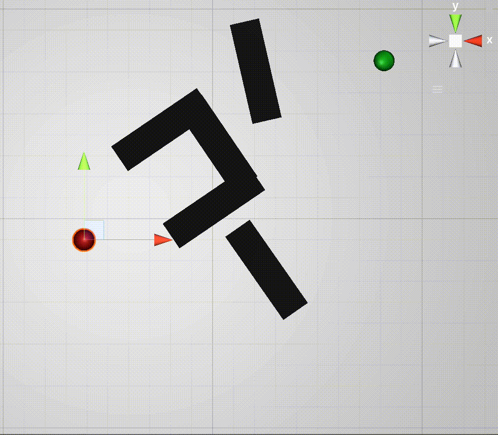

# Unity RRT Path Search
This project is a Unity (C#) implementation of various versions of the sampling-based path search algorithm ['Rapidly-exploring random tree' (RRT)](https://en.wikipedia.org/wiki/Rapidly-exploring_random_tree).
The project is mainly built as a search strategy demonstrator and not as a path search plugin, even though it can be used as such.

The RRT search is performed until a path is found or the set maximum number of nodes added to the search tree is reached.
The RRT* based algorithms continue after finding a path and always run until reaching the set node limit.

## Features
* Contains 9 RRT variations, listed and explained [here](#implemented-rrt-strategies)
* All implemented RRT strategies can be run as 2D or 3D path search (except the planar searches, these always search in 3D)
* The used search strategy can be changed at runtime in the Unity inspector window 
* The found path, as well as the search tree, can be displayed in the scene
* All search parameters which influence the search performance can be edited in the Unity inspector window at runtime.
* Allows to easily add other RRT strategies.

## Implemented RRT Strategies
1. [RRT Basic](#rrt-basic)
2. [RRT Informed](#rrt-informed)
3. [RRT Informed With Reduction](#rrt-informed-with-reduction)
4. [RRT*](#rrt*)
5. [RRT* Informed](#rrt*-informed)
6. [RRT* Informed Pruning](#rrt*-informed-pruning)
7. [RRT* Informed Pruning Ellipse (CKA Informed RRT*)](#RRT*-Informed-Pruning-Ellipse-(CKA-Informed-RRT*))
8. [RRT Informed Planar](#rrt-informed-planar)
9. [RRT Informed Planar With Reducion](#rrt-informed-planar-with-reduction)

## RRT Strategies Overview
A short explanation of each implemented RRT strategy. 
The gifs of the path search are slowed down for better visualisation. 
Here the red sphere is the start position, the green sphere the target and the black objects are obstacles.
The RRT is blue and the found path is red.

### RRT Basic
Implementation of the [most basic RRT search algorithm](https://en.wikipedia.org/wiki/Rapidly-exploring_random_tree) without any optimization.
Nodes are added to the tree in a completely random manner, hence the position of a new node is always random.

 

### RRT Informed
Implementation of the informed RRT search algorithm. 
This strategy knows the target position and therefore biases the search towards the target. 
This reduces the overall required tree size and results in faster convergence. 
The target bias is editable in the inspector window.

 

### RTT Informed With Reduction
Implementation of an adapted [informed RRT](#RRT-informed) search algorithm. 
This strategy only differs in one way; nodes that fail to extend to possible new nodes repeatedly are removed from the search tree, in this case, the failure count of the parent node is also incremented.
This strategy reduces the risk of local minima and improves the search performance for complex cases, where the normal search would get stuck in local minima.
After how many failures a node should be removed from the tree is editable in the inspector window.

 

### RRT*
Implementation of the basic [RRT* algorithm](https://journals.sagepub.com/doi/abs/10.1177/0278364911406761). 
This strategy allows finding the shortest possible path when running the search long enough. 
This is because the existing path is improved when a better one is found and the tree is restructured throughout the search process.
A new node is added as a child to the parent node (which is within a certain radius) which enables to reach the new node with the lowest cost possible.
The tree is also restructured if neighbour nodes within the given radius are better reachable through the new node.

 

### RRT* Informed
This strategy is a combination of the [informed RRT](#RRT-informed) and the [RRT*](#rrt*). 
It works like the RRT* but it is biased towards the target until the first path is found. 
For the following search for shorter paths the target bias is logically no longer needed, hence new nodes are added in a completely random manner.
The target bias is editable in the inspector window.

 

### RRT* Informed Pruning
Implementation of an adapted [informed RRT*](#rrt*-informed), in this strategy the tree is pruned every time a new shorter path is found. 
So if a shorter path than the current one is found, every node and its children are removed, where the combined distance to the end and start position is higher than the currently shortest found path.
These nodes are removed because they logically couldn't be part of a shorter path when the direct line to and from the node is already longer than the current shortest path.

This reduces the tree size and therefore the search time.

 

### RRT* Informed Pruning Ellipse (CKA Informed RRT*)
This strategy is based on the [RRT* Informed Pruning](#rrt*-informed-pruning) and commonly known as the Informed RRT*, but I named it differently in this project.
The idea of the Informed RRT* is proposed and described in this [research paper](https://www.ri.cmu.edu/pub_files/2014/9/TR-2013-JDG003.pdf) and explained visually in [this video by the author](https://www.youtube.com/watch?v=nsl-5MZfwu4).
The main idea is, that as soon as a path is found, only new nodes are added to the tree which could potentially improve the current path.
For this new nodes need to be placed within an ellipse, which is defined by the start, target and the current shortest path.
This implementation differs from the proposed Informed RRT* strategy in one way, the tree is also pruned every time a new path is found.
Which further reduces the tree size and therefore improves the performance.

 

### RRT Informed Planar 
An adapted version of the [Informed RRT](#RRT-informed), to improve the search speed in 3D by searching paths within a 2D plane.
In general, it works like the normal [informed RRT](#rrt-informed) algorithm, but it performs 3 different steps.

   1. Try to reach the target in a straight line
   2. If reaching the target in a straight line fails, a search for a path on the vertical and horizontal plane which are defined by the connecting line from the start to the goal position, is attempted. 
   Until the maximum allowed nodes in the plane is reached or a path is found. When no path is found in the vertical plane, the tree is cleared and a search in the horizontal plane is performed.
   3. If these three attempts had no success, a normal informed RRT strategy is used until the path is found.

This strategy returns 2D paths in most scenarios and is also able to find the straight-line path to a target if one exists.
Searching only in 2D space reduces the tree size and improves the performance.

I came up with this strategy by myself, hence there is no good reference for this. 
It was used to find more natural collision-free robot arm trajectories. 
This strategy, however, has no advantage in scenarios that are comparable to 3D mazes, where no 2D paths exist.

### RRT Informed Planar With Reduction
Implementation of an adapted [RRT Informed Planar](#rrt-informed-planar) search algorithm. 
This strategy only differs in one way; nodes that fail to extend to possible new nodes repeatedly are removed from the search tree, in this case, the failure count of the parent node is also incremented.
This strategy reduces the risk of local minima and improves the search performance for complex cases, where the normal search would get stuck in local minima.
After how many failures a node should be removed from the tree is editable in the inspector window.

|  |  |
| ------------- |:-------------:|
| RRT Informed Planar With Reduction in 3D | RRT Informed in 3D |